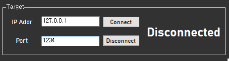
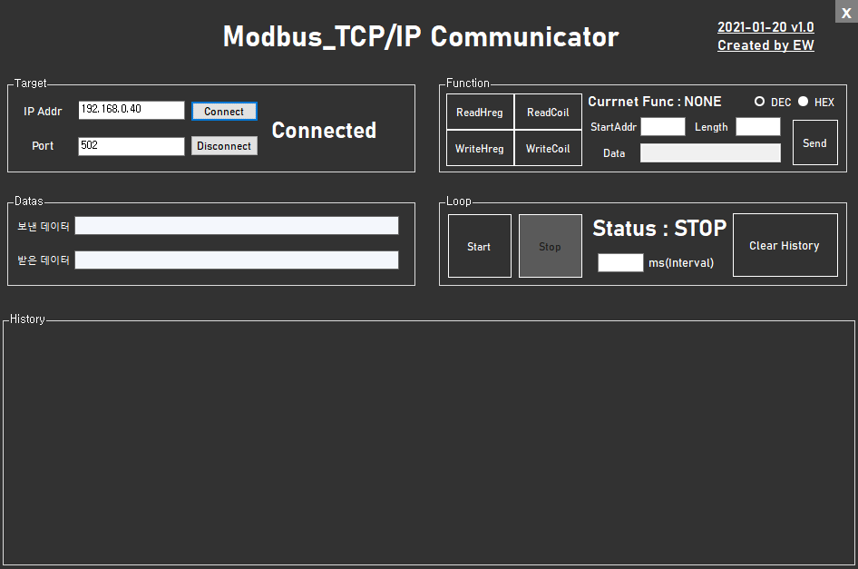

# C_Sharp Projects

## 1. Modbus_TCP/IP 
### >How to use?

#### First. Open File

#### Second. Put in your IP address and Port number in here

#### Third. If connection success, all of the functions will be enabled like below

